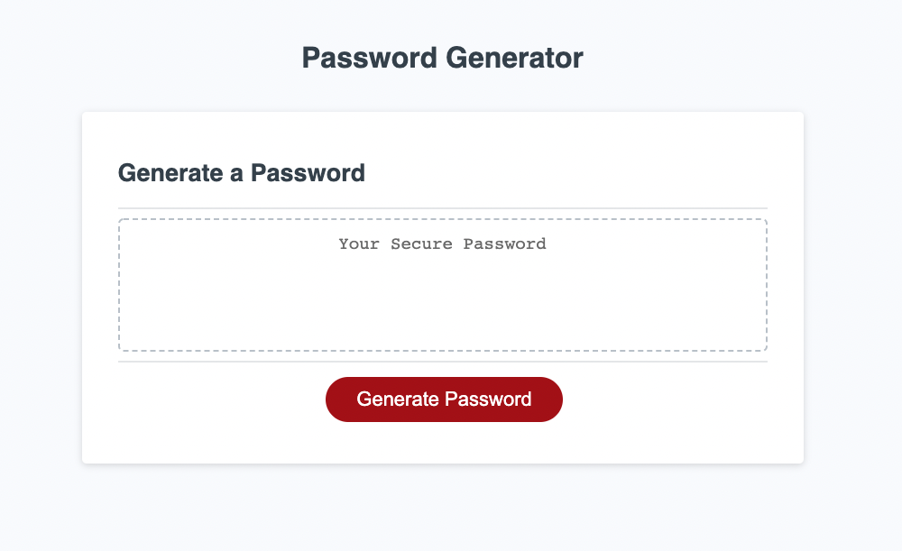

# Random Password Generator

## Description

I undertook this project in order to help people easily create secure passwords for logins with various different forms of requirements. Through a series of prompts, the user is able to create a randomised password with a variety of different types of characters of their choosing.

The creation of this project allowed me to gain experience with a number of the different aspects and uses of javascript, including the use of randomised generators, for loops, if statements and functions. It allowed me to better grasp the fundamentals of coding logic and to apply what I have learnt to creating a useful program.

 

## Usage

The individual is to click on the 'Generate Password' part of the page. They will then be directed to answer a series of prompts that ask them to enter a password length, as well as whether or not they want lowercase, uppercase, numeric and/or special characters in their password. The program then displays their randomly generated password.

If the user does not input an adequate value or does not select any type of characters to include in their password, they are asked to follow the prompts properly before a password is able to be provided to them.

 

